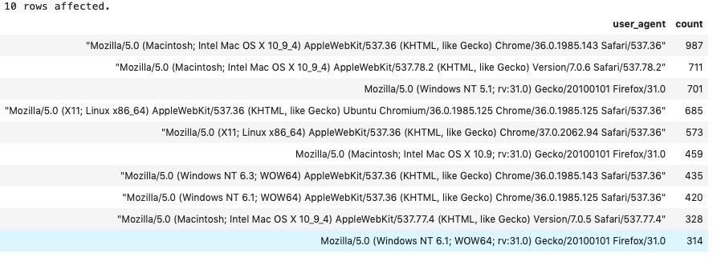
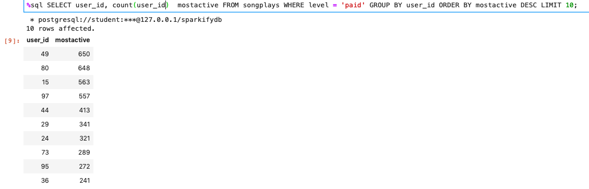

# DATA MODELING WITH POSTGRES

## Purpose of this database

The purpose of the database is to provide to Sparkify with information in a friendly format that allows them to query and obtain answers to their questions. The information gathered by Sparkify is in the format of json files that contains songs information as well as the logs of the activities performed by users regarding themselves as well as about what they listen to, when, etc.

Processing this log files and include this information in a well designed database can provide Sparkify with ways to understand better their customers and their behaviors. That way they can implement solutions that address both organizational as well as customer needs.

## Justification of database schema and ETL pipeline

The database created is a denormalized database (star schema) that has four dimensional tables (users, songs, artists and time) which are descriptive attributes of the fact data. The database contains a fact table (songplays) and some relevant associated information. This is an effective way for handling simpler queries and can provide simplified business answers.  A start schema like the one in Sparkify database produces query performance gains since it is a read-only. Executing aggregation operations are easy and efficient. See some examples below.

It can be used to build OLAP cubes for analytical purposes. 

The dimensional tables are USERS, SONGS, ARTISTS and TIME and are created as follows:

- users (user_id  int PRIMARY KEY, first_name varchar, last_name varchar, gender varchar, level varchar)
- songs (song_id varchar PRIMARY KEY, title varchar, artist_id varchar, year int, duration numeric)
- artists (artist_id varchar PRIMARY KEY, name varchar, location varchar, latitude numeric, longitude numeric)
- time (start_time timestamp PRIMARY KEY, hour smallint, day smallint, week smallint, month smallint, year int, weekday smallint)

The fact table (SONGPLAYS) is defined as follows:

- songplays (songplay_id serial PRIMARY KEY, start_time timestamp, user_id int, level varchar, song_id varchar, artist_id varchar, session_id int, location varchar, user_agent varchar)

## How to run

This project requires PostgreSQL and Python.  In addition need two libraries installed for our scripts to run - Pandas (to be able to read JSON files into dataframes object and perform operations on them) and Psycopg (to inter act with the database).

You can find following scripts in the directory :

- etl.ipynb (Jupyter notebook file with sample ETL process)
- etl.py (script which runs ETL, processing log files and transporting data to database)
- create_tables.py (contains drop and create tables queries)
- sql_queries.py (contains SQL queries to create tables, insert and select data to tables)

The directory data which contains all log files in JSON format
Steps to run project and gather stats:  

- In the Terminal (command line) run command:
	create_tables.py  

	This will create Sparkify database including the fact and all Dimensions tables. If the tables already exist they will be dropped.

- In the Terminal(command line) run command:
	etl.py 

	This will run the ETL process, showing in the screen the details about processed log files.

After running both scripts we have now data organized in tables that you can query for different analysis. In order to connect to the  database from terminal please execute command:

psql -d sparkifydb -U student

As an example, let’s imagine you want to know which are the 10 most popular browser among your users:

SELECT user_agent, count(user_agent) FROM songplays GROUP BY user_agent ORDER BY count(user_agent) DESC LIMIT 10;

The output of such query will be as follows:

We can see that the most popular browser is Chrome on OS X followed by Safari  also in OS X.

Imagine now that you would like to know which are Sparkly most active paid users. We will run the following SQL statement:

SELECT user_id, count(user_id)  mostactive FROM songplays WHERE level = 'paid' GROUP BY user_id ORDER BY mostactive DESC LIMIT 10;
  
Which will provide the following results:

