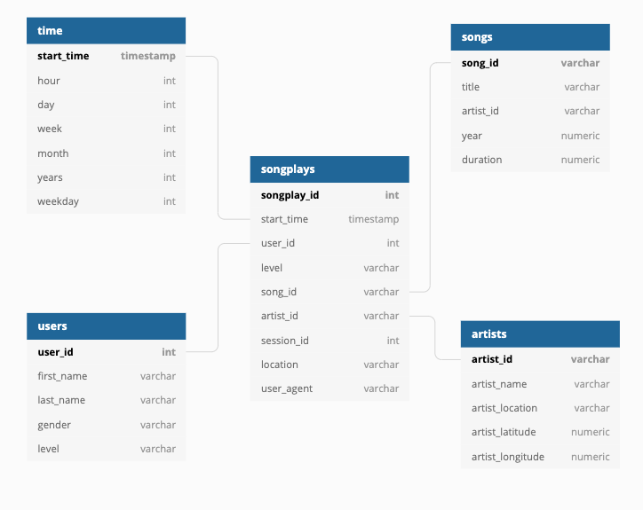

# Data Engineering Nanodegree
# Project 3: Data Warehouse with Amazon Redshift

## Introduction

For this project I am creating a data warehouse for the analytics team of a company that provide music streaming services. Currently data resides in a S3 bucket and it is composed of two main types: JSON logs on user activity on the app and a directory with JSON metadata on the songs available in their app.

### Achievements of this initiative

An ETL pipeline has been built. It extracs data from S3, creating two staging tables in a Redshift cluster. After that is completed a transformation and loading process takes care of creating a set of dimensional tables combined with a fact table (start schema) for the analytics team to find insights in what user activity indicates about listening to music. 

To validate the results there are extractions completed in the Jupyter noteebok that can be run after the ETL process.

The steps to complete this activitiy required:

* Building out an ETL pipeline using Amazon Web Services (AWS) SDK, Redshift, Python and PostgreSQL.
* Setting up IAM Roles, Redshift Clusters, Config files and security groups.
* Developing a pipeline to connect to Redshift cluster and `COPY` data from the S3 buckets to the new redshift staging tables.
* Creating a database with tables designed to optimize queries on song play analysis (4 dimensional tables and a fact table using a standard star schema approbach).
* Testing the database and ETL pipeline by running some queries .

# Process to run the Scripts

Please notice that in order to complete this test you will need to use and run accordingly the follwing Jupyter notebook : `Create Redshift Cluster.ipynb`. In that notebook you find the necessary steps to:

* Creating a RedShift Cluster using AWS Pythn SDK (infrastructure-as-code)
* Cleate clients for IAM, EC2, S3 and RedShift (including review and validation of data sources in S3)
* Connect to Database
* Validate results of the ETL process (once is completed)
* Clean resources (delete RedShift Cluster when not needed anymore)

The ETL pipeline validation process is available in this workspace where you will find the following files: `create_tables.py`, `etl.py` and `sql_queries.py`. The process is as follows:

* From the terminal please run `python create_tables.py`. That process will drop any existing tables and create the new tables with the correct column data types and conditions. 
* After that process is concluded please run `python etl.py` also from the terminal screen. That will the execute the COPY and INSERT SQL queries that are outlined in `sql_queries.py`. This will copy the log-data and song-data from the `udacity-dend` S3 bucket, into corresponding staging tables and from there the data will be inserted into various tables that follow a star schema and are optimized for song query analysis. Please notice that this process (with the current data provided in the S3 bucket and using a 4 nodes RedShift Cluster takes around 4'30").

There is also a `dwh.cfg` config file used to provide the necessary AWS related configuration details to connect to the redshift cluster. S3 bucket, etc. Although the file is provided the personal AWS details have been removed.

# Available Data

### Song Dataset
The first dataset is a subset of real data from the [Million Song Dataset](https://labrosa.ee.columbia.edu/millionsong). Each file is in JSON format and contains metadata about a song and the artist of that song. The files are partitioned by the first three letters of each song's track ID. For example, here are filepaths to two files in this dataset.

```
song_data/A/B/C/TRABCEI128F424C983.json
song_data/A/A/B/TRAABJL12903CDCF1A.json
```
And below is an example of what a single song file, TRAABJL12903CDCF1A.json, looks like.
```
{"num_songs": 1, "artist_id": "ARJIE2Y1187B994AB7", "artist_latitude": null, "artist_longitude": null, "artist_location": "", "artist_name": "Line Renaud", "song_id": "SOUPIRU12A6D4FA1E1", "title": "Der Kleine Dompfaff", "duration": 152.92036, "year": 0}
```
### Log Dataset (users' related activity)
The second dataset consists of log files in JSON format generated by this event simulator based on the songs in the dataset above. These simulate app activity logs from a music streaming app based on specified configurations.

The log files in the dataset are partitioned by year and month. For example, here are filepaths to two files in this dataset.

```
log_data/2018/11/2018-11-12-events.json
log_data/2018/11/2018-11-13-events.json
```

# Star schema created for the analysis of songs played

Using the song and log datasets a star schema fully optimized for queries on song play analysis will be built each time the ETL process described above is run. This schema includes the following tables:



#### Fact Table
1. fact_songplays - records in log data associated with song plays i.e. records with page `NextSong`
    * songplay_id, start_time, user_id, level, song_id, artist_id, session_id, location, user_agent

#### Dimension Tables
2. <b>dim_users</b> - users in the app
    * user_id, first_name, last_name, gender, level
3. <b>dim_songs</b> - songs in music database
    * song_id, title, artist_id, year, duration
4. <b>dim_artists</b> - artists in music database
    * artist_id, name, location, lattitude, longitude
5. <b>dim_time</b> - timestamps of records in <b>songplays</b> broken  down into specific units
    * start_time, hour, day, week, month, year, weekday
